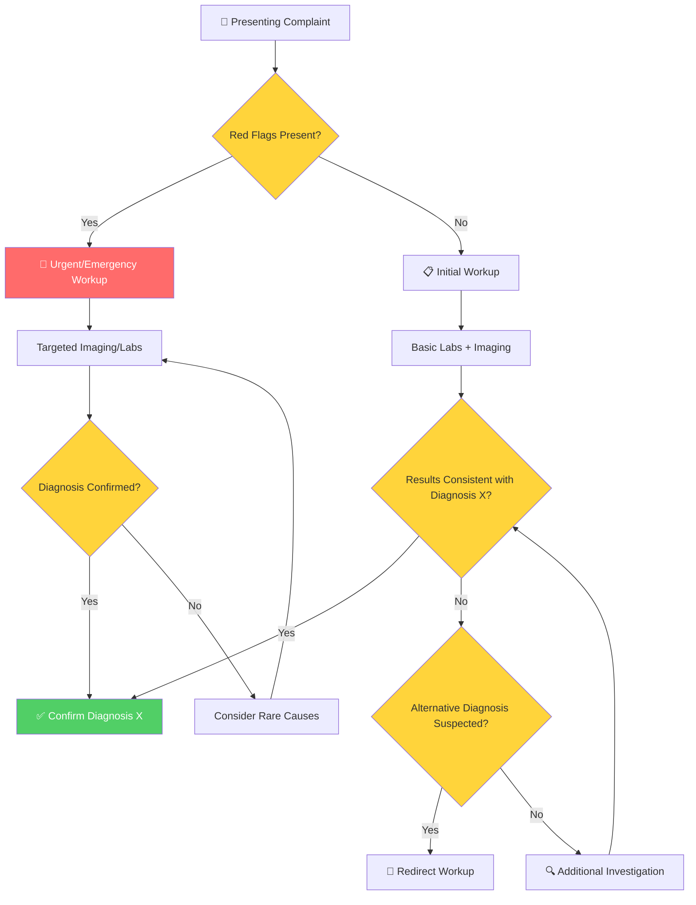
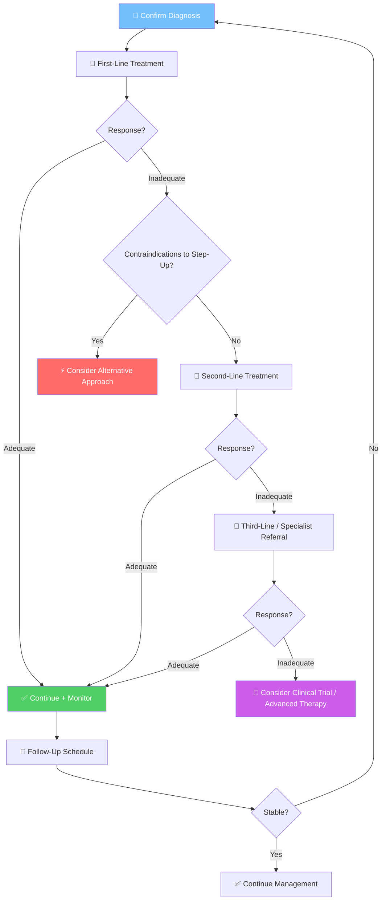
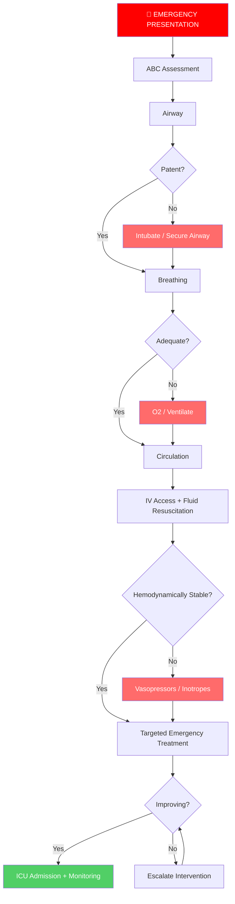
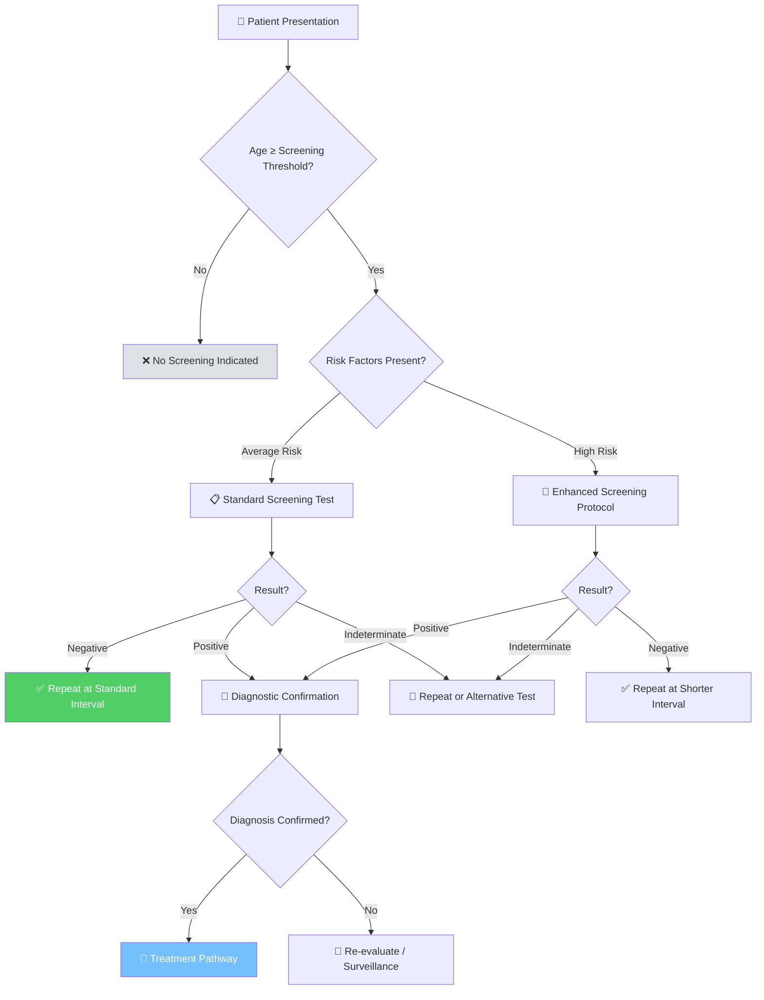
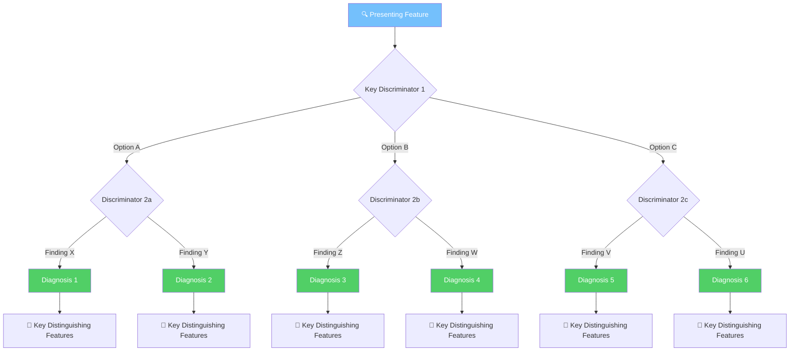

# Clinical Flowchart Patterns — Mermaid Templates

This file provides ready-to-adapt Mermaid flowchart templates for common clinical algorithm types. Use these as starting points and customize the nodes, branches, and labels to match the extracted content.

---

## Pattern 1: Diagnostic Workup Flow

Use when: The document describes how to investigate a presenting complaint or suspected diagnosis.

**Adaptation guide:**
- Replace "Presenting Complaint" with the specific complaint (e.g., "Chest Pain," "Dyspnea")
- Add specific red flags from the text
- Replace "Diagnosis X" with the suspected condition
- Add specific labs/imaging mentioned in the document
- Add branch points for differential diagnosis paths

---

## Pattern 2: Treatment Escalation Flow

Use when: The document describes a step-wise treatment approach (first-line → second-line → etc.).

**Adaptation guide:**
- Replace "First-Line" with specific drug/therapy names
- Add dose information where relevant
- Include monitoring parameters for each step
- Add specific contraindications that redirect the algorithm
- Include timeframe expectations ("reassess in 2-4 weeks")

---

## Pattern 3: Emergency Management Flow

Use when: The document describes acute/emergency management (ACLS, sepsis, status epilepticus, etc.).

**Adaptation guide:**
- Add specific emergency interventions (e.g., "Defibrillate VF/VT" for cardiac arrest)
- Include drug names and doses (e.g., "Epinephrine 1mg IV q3-5min")
- Add time targets (e.g., "within 10 minutes")
- Include "DO NOT" actions as red-flagged nodes

---

## Pattern 4: Screening Algorithm Flow

Use when: The document describes who to screen, when, and with what test.

**Adaptation guide:**
- Add specific age thresholds from the guideline
- List specific risk factors that change the algorithm
- Name the screening test (mammography, colonoscopy, etc.)
- Include recommended intervals (annually, every 2 years, etc.)

---

## Pattern 5: Differential Diagnosis Tree

Use when: The document presents a differential diagnosis and helps distinguish between conditions.

**Adaptation guide:**
- Replace "Presenting Feature" with the specific symptom/finding
- Use discriminators from the text (e.g., "Acute vs Chronic," "Painful vs Painless")
- Add specific distinguishing features at each leaf
- Consider adding a comparison table as a companion

---

## General Flowchart Style Rules

1. **Node shapes:**
   - `[]` Rectangle = Action/Step
   - `{}` Diamond = Decision/Question
   - `([ ]) Rounded = Start/End
   - `[[ ]] Subroutine = Sub-process (link to another flowchart)

2. **Colors:**
   - 🔴 Red (#ff6b6b): Emergency, danger, don't-miss
   - 🟡 Yellow (#ffd43b): Decision points
   - 🟢 Green (#51cf66): Positive outcome, confirmed
   - 🔵 Blue (#74c0fc): Process, investigation
   - 🟣 Purple (#cc5de8): Specialist/referral
   - ⚪ Gray (#dee2e6): Not indicated, ruled out

3. **Emojis:** Use sparingly for visual anchoring — 🚨 emergency, 💊 drug, 🔬 test, ✅ confirmed, ❌ ruled out, 📋 assessment

4. **Flow direction:**
   - `TD` (top-down) for sequential processes
   - `LR` (left-right) for comparison/parallel paths
   - Use `---` for same-level connections, `-->` for directional flow

5. **Keep it readable:**
   - Maximum 15 nodes per flowchart — if more, split into sub-flowcharts
   - Keep node labels under 30 characters
   - Use subgraphs to group related steps
